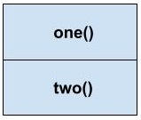

> # In-memory storage

1. What is a ‘call’?

    - invoking (calling) a function
1. How many ‘calls’ can happen at once?

    - one at a time -- synchronous (not asynchronous)
1. What does LIFO mean?

    - last-in, first-out
1. Draw an example of a call stack and the functions that would need to be invoked to generate that call stack.

    

    ```js
    function one (){
      console.log('first function');
    }

    function two (){
      one();
    }

    two();
    ```

1. What causes a Stack Overflow?

    - a function that calls itself and has no exit point (for example, an accessible return statement)

---

1. What is a ‘reference error’?

    - when code tries to use a variable that hasn't been declared yet
1. What is a ‘syntax error’?

    - any kind of error where your syntax is wrong -- typos, illogical handling that results in typos, etc.
1. What is a ‘range error’?

    - when code tries to assign an invalid length to an object (ex: length of -1 to a string that is several characters long)
1. What is a ‘tyep error’?

    - when code tries to use a data type in a way that is incompatible (ex: using a string method on a boolean)
1. What is a breakpoint?

    - a conditional that can stop code from executing beyond a certain point, for troubleshooting purposes
1. What does the word ‘debugger’ do in your code?

    - it shows the execution history of the code up to that point, again, for troubleshooting purposes