> # Introduction to SQL

- SQL (Structured Query Language) = used by technical and non-technical users to manage data in relational databases
  - relational database = 2-D database (rows and columns) where columns are properties/attributes of a thing, and each row is another instance of a thing
- SELECT statement (query) = common query used to retrieve data from a database
- WHERE clause = sets conditions for a row (instance) to be included in results or not

- SQL is widely used -- though noSQL (not-only SQL) is also widely used -- in database management
- SQL queries that update databases (INSERT, UPDATE, DELETE/DROP, etc,) don't have an undo function and so testing is very necessary

> ## Operators

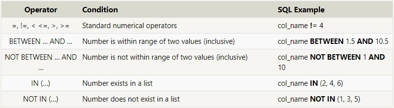
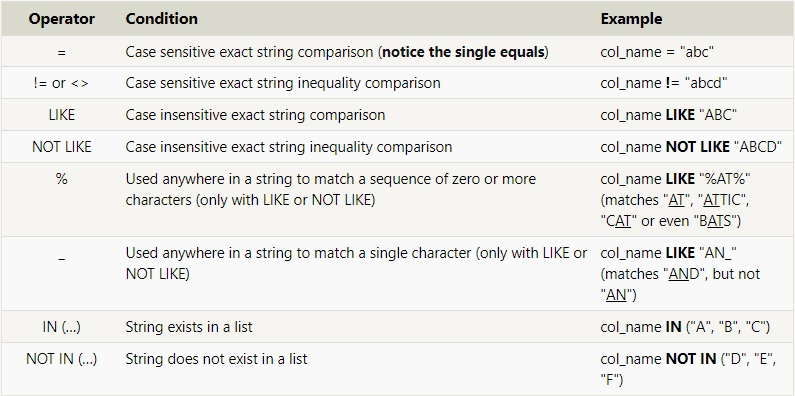

(^ credit: https://sqlbolt.com/lesson/select_queries_with_constraints)

&nbsp;

> ## Assignment screenshots

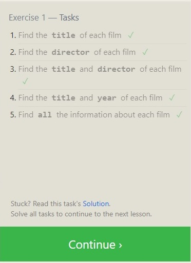
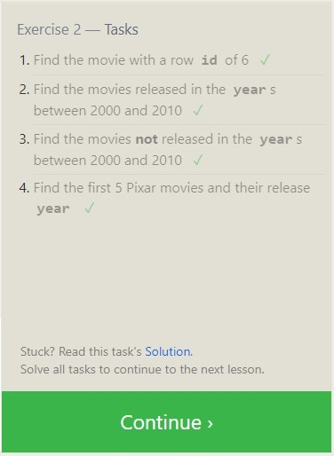
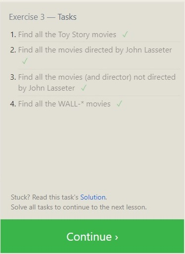

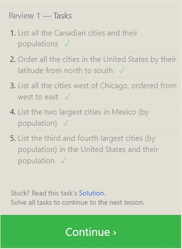
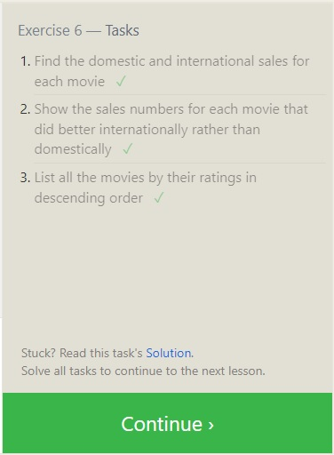
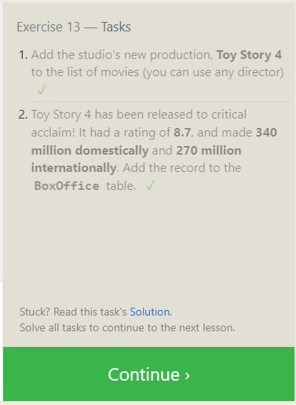
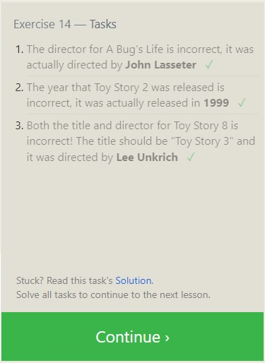
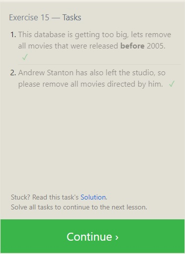
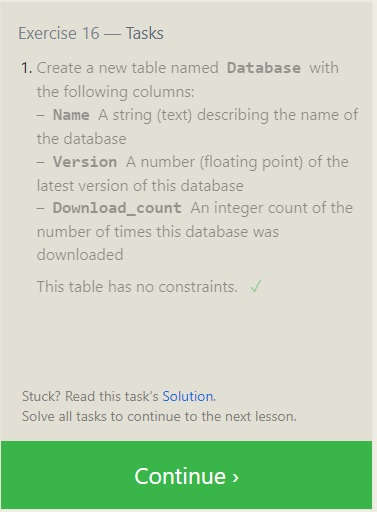
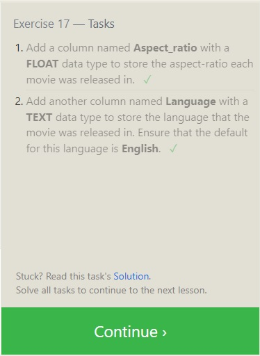
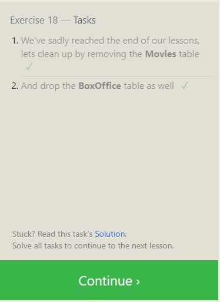